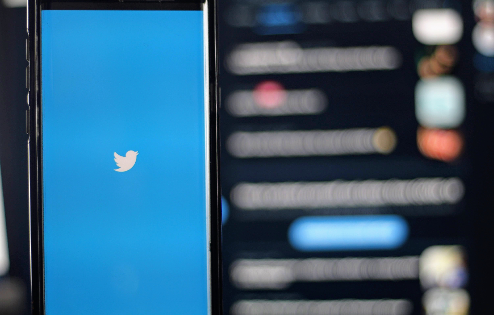

# NLP for Classifying Consumer Tweets

## Phase 4 Project
### Flatiron Online Data Science Bootcamp

Prepared and presented by: [Leah Pope](https://www.linkedin.com/in/leahspope/)

Presentation: [here](./extras/PhaseFourProject_LeahPope.pdf)

Blog: [On Medium](https://leahspope7.medium.com/comparing-vader-and-text-blob-to-human-sentiment-77068cf73982)




# Introduction

The goal of this project is to build a Natural Language Processing model to analyze sentiment about Apple and Google products. I'll classify a Tweet as negative, positive or neutral based on its content.


The Stakeholders for my project are marketing professionals in either company who are interested in learning consumer sentiment. It appears that these tweets were gathered during a session of the South by Southwest film, culture, music, and technology conference. This consumer sentiment would be of interest to the conference marketing professionals and vendor organizers.


# Data Description
The dataset for the project comes from [CrowdFlower](https://data.world/crowdflower) via [data.world](https://data.world/crowdflower/brands-and-product-emotions). Human raters rated the sentiment in over 9,000 Tweets as positive, negative, or neither.

# EDA Questions Explored
### Question 1: What is the general breakdown for these Tweets?
### Question 2: Are the two brands represented equally in the labeled data?
### Question 3: What insights can the data provide for specific brands?
#### [Notebook](./notebooks/data_cleaning_and_eda.ipynb)


# Corpus EDA Questions Explored
### Question 1: What are the most common words in Postitive/Negative/Neutral Tweets?
### Question 2: Is there a difference in character count between Postitive/Negative/Neutral Tweets?
#### [Notebook](./notebooks/data_cleaning_and_eda.ipynb)

# Modeling
### Creating binary and multiclass classifiers for Tweets on Apple and Google products.
#### [Notebook for Binary Classifiers](./notebooks/modeling.ipynb)
#### [Notebook for Multiclass Classifers](./notebooks/modeling2.ipynb)


# Conclusions
## Binary Classifer - winning model
* RandomForest with RandomOverSampling: Weighted F1 Score of __0.87__

None of the binary classifiers did a good job with classifying Negative tweets, even with RandomOverSampling. __RandomForest__ and __RandomForest with RandomOverSampling__ had the highest weighted F1 scores of all models I trained.  I'm calling __RandomForest with RandomOverSampling__ the winner as it has a slightly better True Positive rate for correctly identifying Negative Tweets (0.37 vs 0.3). This is still crummy.

Here's the breakdown of all Binary Classifier Models and scores:
* RandomForest - 0.87
* RandomForest ROS - 0.87  
* Multimonial NB  - 0.82
* Multimonial NB ROS - 0.85


## Multiclass Classifer - winning model
* RandomForest with RandomOverSampling: Weighted F1 Score of __0.68__

RandomForest (and RandomForest with RandomOverSampling) had the highest weighted F1 scores of all models I trained. I'm calling RandomForest with RandomOverSampling the winner as it has a slightly better True Positive rate for correctly identifying Negative Tweets (0.29 vs 0.25). I imagine Negative tweets are most interesting to stakeholders. It also has a better True Positive rate for correctly identifying Positive Tweets (0.56 vs 0.48). These numbers are still pretty poor.

Here's the breakdown of all Multiclass Classifier Models and scores:
* RandomForest - 0.68
* RandomForest ROS - 0.68
* Multimonial NB - 0.60
* Multimonial NB ROS - 0.62


# Stakeholder Recommendations
After analyzing the most common terms/bi-grams in Positive and Negative tweets, I can make the following Stakeholder Recommendations:

From the Negative Tweets, we see “iPad design, design headaches, and iphone battery” as common terms. 
* Recommend to check iPhone battery performance
* Revaluate iPad design in light of this Negative sentiment

From the Positive Tweets, we see “Apple store, opening temporary, and Google party” as common
terms. 
* Recommend to repeat those two well received events


# Next Steps/Future Work
Futher analysis into the following areas could yield additional insights.

* Check if punctuation count could be a good feature for Tweet classification.
* Use [spacy](https://spacy.io/) to replace [NLTK](https://www.nltk.org/)
* Try using SMOTE to address class imbalance and see if it results in similar increases in overfitting as RandomOverSampling
* Hyper-parameter tuning for the Random Forest classifiers.
* Better understanding of using [LIME](https://github.com/marcotcr/lime) to explain model behaviour.
* Try Transfer Learning using the [GloVE](https://nlp.stanford.edu/projects/glove/) pre-trained [word embeddings for Twitter](https://github.com/stanfordnlp/GloVe)
* Get more Tweets for the corpus!
    * Research for pre-labled Tweets
    * Perform Sentiment Analysis using [VADER](https://github.com/cjhutto/vaderSentiment) and [Text Blob](https://github.com/sloria/textblob) tools and compare tool results to the human-annotated Tweets in this corpus. If the combined tool sentiment is similar enough to human labled sentiment, I could get more Google/Apple product Tweets and label them using tools to create a larger corpus. :)

# For More Information
* Review the non-technical presentation [here](./extras/PhaseFourProject_LeahPope.pdf)
* Contact the author [Leah Pope](https://www.linkedin.com/in/leahspope/)


# Repository Structure
```
--notebooks
----data_cleaning_and_eda.ipynb
----modeling.ipynb  (binary classifiers are here)
----modeling2.ipynb (multiclasss classifiers are here)
--data
----cleaned_tweets_all.csv
----cleaned_tweets_positive.csv
----cleaned_tweets_negative.csv
----cleaned_tweets_neutral.csv
----crowdflower-brands-and-product-emotions/ (dir for data downloaded from challenge website)
--images (dir for images)
```
